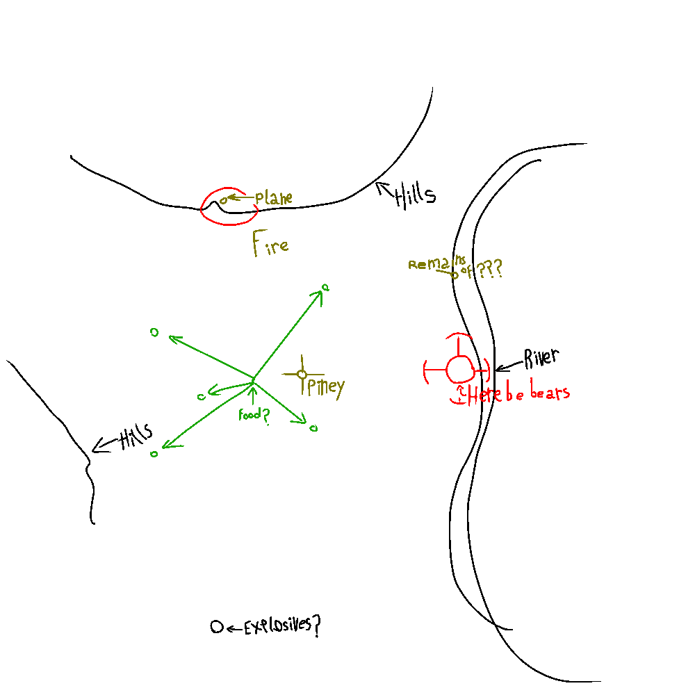

##Inventory

- Survivalist's axe
- Pick
- Emergency blanket
- About a day or two's worth of food and water. 
- Heavy oversized jacket
- Shovel
- Some rope

##Effects on the counter

| Action           | Effect             |
|------------------|--------------------|
| Wet              | -2  **IP**         |
| Paralytic poison | -1  **IP** [^1]    |
| Bloodloss        | (See table)        |
| Sleeping warmly  | +2 **I**, +5 **T** |

####Bloodloss:
| Action           | Effect             |
|------------------|--------------------|
| Initial          | -2 **IP**          |
| +5 turns         | -5 **IP**          |
| +10 turns         | -9 **IP**          |

*Notation:

 - **I**: Applied immediately.
 - **T**: Applied over time.
 - **P**: Active until treated.

##Map

[^1] : Goes away by sleeping.